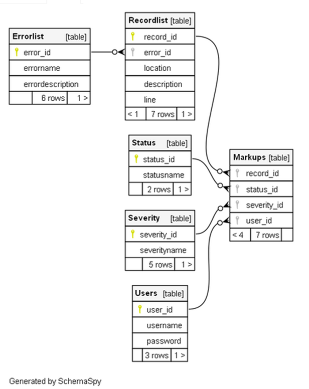
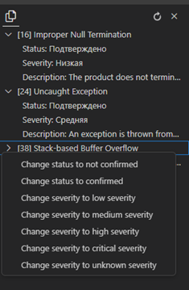
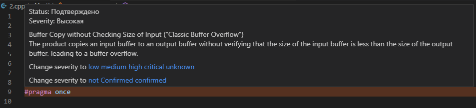

# ThreatScope

Данное расширение позволяет использовать результат работы статического анализатора уязвимостей, которые хранятся в базе данных.

## Функции

Суть данного плагина заключается в возможности использовать любой статический анализатор для хранения информации и подсветки синтаксиса, однако для каждого анализатора стоит создать скрипт записывающий результат в базу данных. 

Этот репозиторий включает в себя только структуру базы данных и плагин создающий разметку. 

Для использования плагина, база данных должна соответсвовать такой архитектуре:

`Users` – содержит список пользователей и, соответственно, меняется при внесении изменения

`Severity` – содержит список критичностей уязвимости(не указана, низкая, средняя, высокая, критичная)

`Errorlist` – содержит все возможные уязвимости

`Recordlist` – содержит список уязвимостей с указанием файла и расположения

`Markups` – связывает все эти таблицы и представляет собой список всех уязвимостей, которые нужно подсветить

Сам плагин включает в себя такие функции:

* Подсветка всей строки, в которой находится ошибка 
* Информация о ошибке при наведении на неё
* Возможность изменить критичность/статус ошибки при наведении
* Отдельное окно со списком всех ошибок в открытом файле
* Возможность изменить критичность/статус ошибки в отдельном окне

Окно ошибок и изменение статуса при нажатии ПКМ:

Информация об ошибке при наведении:

## Требования

* Создать БД в PostgreSQL, соответствующую необходимомой архитектуре
* Убедитесь, что установлен `Node.js`

## Настройки

Меню настроек позволяет задать информацию о подключении к БД и позволяет задать цвет для каждого типа уязвимости в формате argb 

